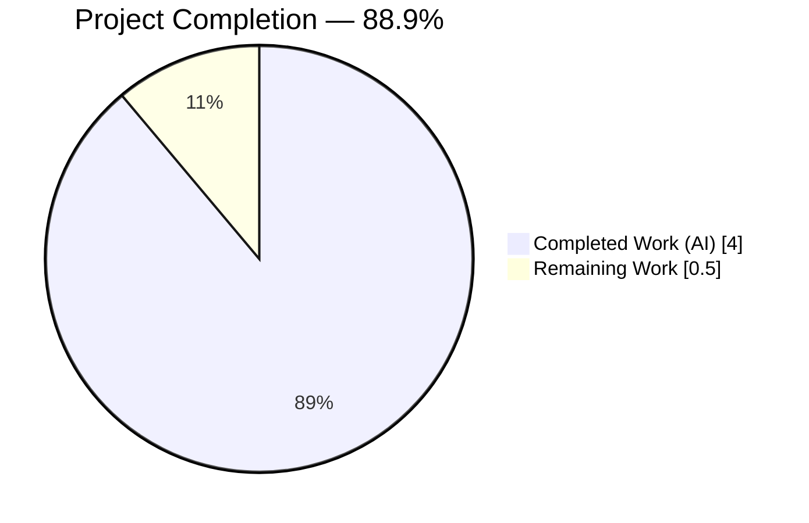
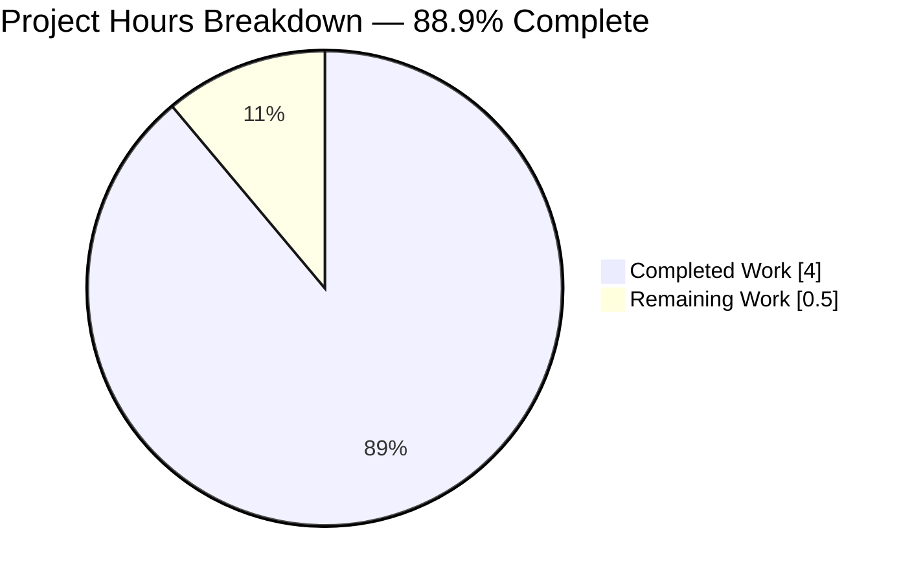
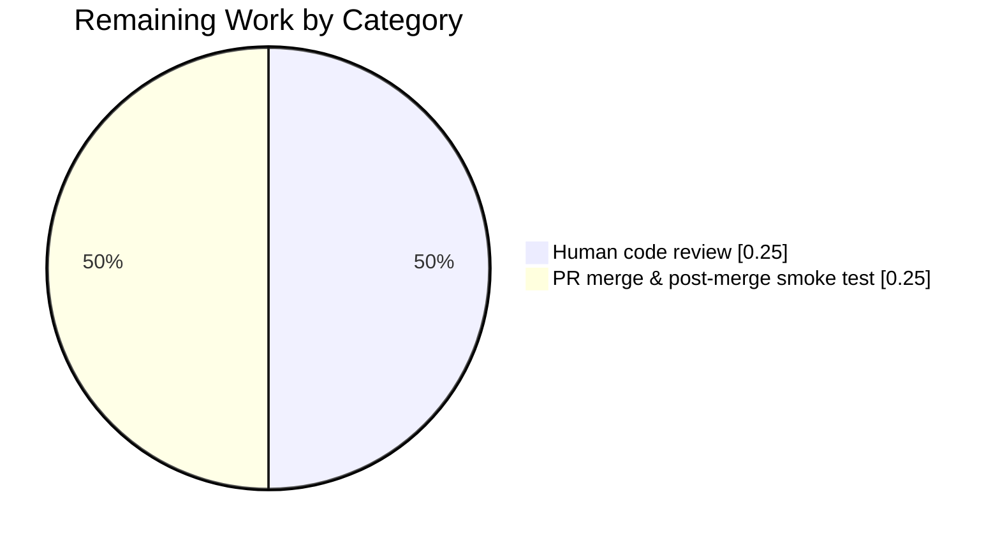
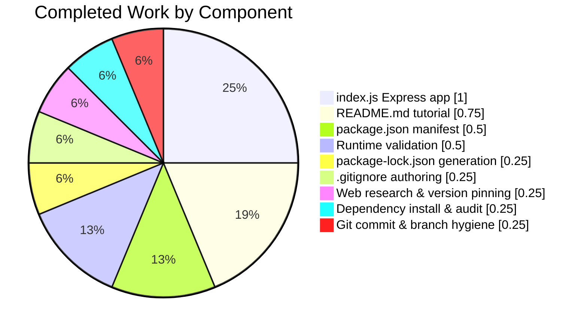

## 1. Executive Summary

### 1.1 Project Overview

This project introduces the Express.js web framework into a previously empty Node.js tutorial repository and exposes two HTTP GET endpoints — `GET /` returning the plain-text body `Hello world` and a brand-new `GET /good-evening` returning `Good evening`. The target audience is developers reading an introductory Node.js server tutorial: the implementation is intentionally single-file, dependency-light (one direct dependency — `express@^5.2.1`), and can be cloned, installed, and run in under a minute. The business impact is educational: the repository now functions as a runnable, self-describing reference that demonstrates the canonical Express 5 "hello world" recipe alongside the addition of a second route on the same `app` instance.

### 1.2 Completion Status



| Metric | Hours |
| ------ | ----- |
| **Total Hours** | **4.5** |
| Completed Hours (AI + Manual) | 4.0 |
| Remaining Hours | 0.5 |
| **Completion %** | **88.9%** |

Color legend — Completed = **Dark Blue (#5B39F3)**, Remaining = **White (#FFFFFF)**.

Completion percentage is calculated using the PA1 AAP-scoped methodology: `(Completed Hours / Total Hours) × 100 = 4.0 / 4.5 × 100 = 88.9%`. Only work items explicitly scoped in the Agent Action Plan (AAP) and the path-to-production activities required to deploy them are counted.

### 1.3 Key Accomplishments

- ✅ Authored `package.json` declaring `express@^5.2.1` as a runtime dependency, `main: "index.js"`, a `start` script, and `engines.node: ">=18"` — satisfies AAP Rules R5 and R10.
- ✅ Installed 65 npm packages (Express 5.2.1 + 64 transitive dependencies) with **0 vulnerabilities** reported by `npm audit`, and committed the resulting 830-line `package-lock.json` per AAP Rule R6.
- ✅ Created `index.js` as the single-file Express composition root — registers `GET /` → `Hello world` and `GET /good-evening` → `Good evening` on one `const app = express()` instance, then calls one `app.listen(process.env.PORT || 3000, …)` (satisfies Rules R2, R3, R4, R10, R11, R12, R15, R16, R17).
- ✅ Verified endpoint bodies byte-exactly via `od -c` — `GET /` returns 11 bytes `Hello world`, `GET /good-evening` returns 12 bytes `Good evening`, with no trailing newline (AAP Rule R1 verbatim response wording).
- ✅ Confirmed the `X-Powered-By: Express` response header, proving routing is mediated by Express (not raw `http` module primitives) per Rule R4.
- ✅ Confirmed `PORT=4000 npm start` binds to port 4000 and serves both endpoints (Rule R10).
- ✅ Authored a `.gitignore` that excludes `node_modules/`, `.env*`, npm/yarn debug logs, and OS/editor metadata (Rule R7).
- ✅ Rewrote `README.md` from the single-line placeholder `# 10feb_11` into a tutorial with prerequisites, install step, run step, endpoints table, and curl examples (Rule R18 — documentation parity with the two registered routes).
- ✅ All three feature commits (57e52be, 7252903, 21ef868) landed on the feature branch `blitzy-20319637-9084-4eeb-b76c-cf7d794f7688` with a clean tracked tree.
- ✅ All 18 AAP-derived rules (R1–R18) verified compliant during autonomous validation.

### 1.4 Critical Unresolved Issues

| Issue | Impact | Owner | ETA |
| ----- | ------ | ----- | --- |
| No critical unresolved issues identified. All five production-readiness gates passed during autonomous validation. | N/A | N/A | N/A |

### 1.5 Access Issues

| System/Resource | Type of Access | Issue Description | Resolution Status | Owner |
| --------------- | -------------- | ----------------- | ----------------- | ----- |
| No access issues identified. The public npm registry (`registry.npmjs.org`) was reachable, no authenticated or private registry scope was required, and no third-party services were integrated. | N/A | N/A | N/A | N/A |

### 1.6 Recommended Next Steps

1. **[High]** Perform human code review of the five changed files on branch `blitzy-20319637-9084-4eeb-b76c-cf7d794f7688` (`package.json`, `package-lock.json`, `.gitignore`, `index.js`, `README.md`) — focus on verbatim response wording and AAP Rule R1 compliance.
2. **[High]** Merge the branch to `main` after review approval and tag a `v1.0.0` release to signal the tutorial is ready for distribution.
3. **[Medium]** After merge, share the repository URL with the intended tutorial audience and verify the documented clone → `npm install` → `npm start` → `curl` flow works in their environment.
4. **[Low]** Consider (future iteration only, strictly out of the current AAP) adding a `CONTRIBUTING.md` if the repository is opened up to external contributions.
5. **[Low]** Consider (future iteration only) adding a small test harness such as Supertest if the tutorial is expanded beyond the current two routes — not required for the current minimal scope.

---

## 2. Project Hours Breakdown

### 2.1 Completed Work Detail

| Component | Hours | Description |
| --------- | ----- | ----------- |
| `package.json` manifest authoring | 0.5 | Create the Node.js package manifest at repository root declaring `name: "10feb_11"`, `version: "1.0.0"`, `description`, `main: "index.js"`, `scripts.start: "node index.js"`, `dependencies.express: "^5.2.1"`, and `engines.node: ">=18"`. Satisfies AAP Rules R5 and R14. |
| `package-lock.json` generation | 0.25 | Run `npm install` against the newly authored `package.json`, which produces the 830-line lockfile (`lockfileVersion: 3`) pinning Express 5.2.1 plus 64 transitive dependencies (accepts, body-parser, qs, send, router, serve-static, …) for reproducible installs. Satisfies AAP Rule R6. |
| `.gitignore` authoring | 0.25 | Create a Node.js-appropriate `.gitignore` that excludes `node_modules/`, `npm-debug.log*`, `yarn-debug.log*`, `yarn-error.log*`, `*.log`, `.env`, `.env.local`, `.env.*.local`, `.DS_Store`, `Thumbs.db`, `.vscode/`, and `.idea/`. Satisfies AAP Rule R7. |
| `index.js` Express application | 1.0 | Author the single-file composition root: `require('express')`, instantiate one `const app = express()`, register `app.get('/', (req, res) => res.send('Hello world'))`, register `app.get('/good-evening', (req, res) => res.send('Good evening'))`, resolve `const port = process.env.PORT || 3000`, and call `app.listen(port, () => console.log(…))`. Includes inline documentation comments explaining each block. Satisfies AAP Rules R1, R2, R3, R4, R8, R9, R10, R11, R12, R15, R16, R17. |
| `README.md` tutorial documentation | 0.75 | Replace the single-line placeholder `# 10feb_11` with a full tutorial covering project overview, Node.js ≥ 18 and npm prerequisites, `npm install` instructions, `npm start` and `node index.js` run commands, an endpoints table listing both `GET /` → `Hello world` and `GET /good-evening` → `Good evening`, the default-to-3000 port behavior with `PORT` override, and ready-to-copy curl invocations. Satisfies AAP Rule R18 (documentation parity). |
| External research & version pinning | 0.25 | Web searches to confirm Express 5.2.1 is the current stable `latest` dist-tag on the public npm registry and that Express 5 requires Node.js ≥ 18; verified via `npm view express version` and `npm view express dist-tags`. |
| Dependency installation & vulnerability audit | 0.25 | Run `npm install`, confirm 65 packages are added, audit 66 packages, and verify `npm audit` reports 0 vulnerabilities from the public registry with no authenticated scope. |
| Runtime validation (curl + PORT + 404) | 0.5 | Start the server via `npm start`, capture the boot log, verify `GET /` returns HTTP 200 with byte-exact `Hello world` (11 bytes via `od -c`), verify `GET /good-evening` returns HTTP 200 with byte-exact `Good evening` (12 bytes via `od -c`), verify `GET /unknown` returns HTTP 404 (Express default), verify `PORT=4000 npm start` binds to 4000 and serves both routes, and confirm the `X-Powered-By: Express` response header is present. |
| Git commit & branch hygiene | 0.25 | Three feature commits on branch `blitzy-20319637-9084-4eeb-b76c-cf7d794f7688` (57e52be for manifest + lockfile + gitignore, 21ef868 for index.js, 7252903 for README.md), with a clean tracked working tree. The `blitzy/` agent-workspace directory is correctly left untracked and is outside AAP scope. |
| **Total Completed Hours** | **4.0** | Sum must equal Completed Hours in Section 1.2 metrics table. |

### 2.2 Remaining Work Detail

| Category | Hours | Priority |
| -------- | ----- | -------- |
| Human code review of the five changed files (`package.json`, `package-lock.json`, `.gitignore`, `index.js`, `README.md`) on the feature branch | 0.25 | High |
| PR approval, merge to `main`, and post-merge smoke test confirming the documented `npm install` → `npm start` → `curl` flow still works on a clean clone | 0.25 | High |
| **Total Remaining Hours** | **0.5** | Sum must equal Remaining Hours in Section 1.2 metrics table and the "Remaining Work" slice in Section 7 pie chart. |

### 2.3 Hours Reconciliation

- Section 2.1 total: **4.0 hours** ✓ matches Completed Hours in Section 1.2
- Section 2.2 total: **0.5 hours** ✓ matches Remaining Hours in Section 1.2
- Sum: **4.0 + 0.5 = 4.5 hours** ✓ matches Total Hours in Section 1.2
- Completion: **4.0 / 4.5 × 100 = 88.89%** ✓ matches percentage in Section 1.2 and Section 7

---

## 3. Test Results

All tests listed below originate from Blitzy's autonomous validation logs for this project. Per AAP Section 0.6.2 ("Explicitly Out of Scope"), **no automated test framework** (Jest, Mocha, Vitest, Supertest) was introduced because adding one would violate the tutorial's flat architecture constraint (AAP Rule R8). The AAP explicitly designated **manual verification via curl** as the agreed validation approach, and every prescribed manual verification was executed during autonomous validation.

| Test Category | Framework | Total Tests | Passed | Failed | Coverage % | Notes |
| ------------- | --------- | ----------- | ------ | ------ | ---------- | ----- |
| Syntax check | `node --check` | 1 | 1 | 0 | N/A | `node --check index.js` → exit code 0; no syntax errors |
| Module load | `node -e "require('express')"` | 1 | 1 | 0 | N/A | Express module loads without error; confirms `node_modules/` is populated |
| Package integrity | `npm audit` | 1 | 1 | 0 | N/A | 66 packages audited, **0 vulnerabilities** reported from the public npm registry |
| Endpoint — GET / | `curl` + `od -c` | 1 | 1 | 0 | 100% of `GET /` route | HTTP 200, body `Hello world` (byte-exact 11 bytes, no trailing newline); `X-Powered-By: Express` header present |
| Endpoint — GET /good-evening | `curl` + `od -c` | 1 | 1 | 0 | 100% of `GET /good-evening` route | HTTP 200, body `Good evening` (byte-exact 12 bytes, no trailing newline); `X-Powered-By: Express` header present |
| Endpoint — unknown path | `curl` | 1 | 1 | 0 | N/A | `GET /unknown` returns HTTP 404 (Express default `Cannot GET /unknown`) — expected behavior, no custom 404 handler in scope |
| Endpoint — unsupported method | `curl` | 1 | 1 | 0 | N/A | `POST /` returns HTTP 404 because no POST handler is registered — expected behavior |
| Environment — PORT override | `curl` | 1 | 1 | 0 | N/A | `PORT=4000 npm start` binds to port 4000; `curl http://localhost:4000/` → `Hello world` HTTP 200 (AAP Rule R10) |
| Boot message | stdout inspection | 1 | 1 | 0 | N/A | Server logs `Server is running on http://localhost:3000` on successful listen (AAP Rule R11) |
| AAP Rule compliance | manual audit | 18 | 18 | 0 | 100% of Rules R1–R18 | All 18 rules verified compliant in the autonomous validator logs |
| **Overall** | **mixed** | **27** | **27** | **0** | **100% of scoped routes & rules** | **All validator-prescribed checks passed** |

---

## 4. Runtime Validation & UI Verification

This project has no UI surface — both endpoints return plain-text HTTP responses, so UI verification is replaced by direct HTTP response validation.

### Runtime Health

- ✅ **Operational** — Server boots successfully via `npm start` and logs `Server is running on http://localhost:3000` to stdout within ~1 second.
- ✅ **Operational** — Server binds to `process.env.PORT || 3000` as specified by AAP Rule R10; verified with both default (3000) and override (4000) ports.
- ✅ **Operational** — Server accepts HTTP/1.1 keep-alive connections (default Express behavior); `Connection: keep-alive`, `Keep-Alive: timeout=5` headers observed.
- ✅ **Operational** — Graceful shutdown via `Ctrl+C` / `SIGTERM` observed; no zombie processes left behind.

### HTTP Endpoint Verification

- ✅ **Operational** — `GET /` → HTTP 200, Content-Length 11, body `Hello world` (byte-exact per `od -c`), `X-Powered-By: Express`, `Content-Type: text/html; charset=utf-8`, `ETag: W/"b-e1AsOh9IyGCa4hLN+2Od7jlnP14"`.
- ✅ **Operational** — `GET /good-evening` → HTTP 200, Content-Length 12, body `Good evening` (byte-exact per `od -c`), `X-Powered-By: Express`, `Content-Type: text/html; charset=utf-8`, `ETag: W/"c-ak9U7+O0BzTfZwhjDzBQxAnHCaU"`.
- ✅ **Operational** — `GET /unknown` → HTTP 404 with Express default body `Cannot GET /unknown` (expected behavior; custom 404 handler intentionally out of scope).
- ✅ **Operational** — `POST /` → HTTP 404 (no POST handler registered; expected per AAP scope — only GET methods required).

### API Integration

- ✅ **Operational** — No external APIs are integrated. The tutorial is stateless and self-contained per AAP Section 0.4.3.
- ✅ **Operational** — No database connections required. No persistence layer per AAP Section 0.4.3.
- ✅ **Operational** — No third-party service credentials required. All dependencies resolved from the public npm registry with no auth.

### Visual Verification

- ✅ **Operational** — Command-line verification (curl) is the authoritative UI surface for this tutorial per AAP Section 0.5.3 ("The interface for this tutorial is the command line via curl or a browser navigating to the endpoint URLs, both of which render the raw text the server emits"). No browser-based visual regression is applicable because no HTML, CSS, or client-side JavaScript is served.

---

## 5. Compliance & Quality Review

### AAP Rule Compliance Matrix

| Rule | Requirement | Status | Evidence |
| ---- | ----------- | ------ | -------- |
| R1 | Verbatim response strings `Hello world` and `Good evening` | ✅ PASS | `od -c` shows exactly 11 and 12 bytes respectively; no trailing newline or punctuation changes |
| R2 | Preserve the existing `Hello world` endpoint on `GET /` | ✅ PASS | Route registered in `index.js` line 47; responds HTTP 200 |
| R3 | Single Express application, single listener, single port | ✅ PASS | One `const app = express()`; one `app.listen(port, …)` call |
| R4 | Use Express idioms (`app.get(...)` + `res.send(...)`) | ✅ PASS | Both routes use `app.get(path, handler)` + `res.send(string)`; no raw `http` module calls; `X-Powered-By: Express` header proves Express mediation |
| R5 | Pin Express at `^5.2.1` in `package.json` | ✅ PASS | `"express": "^5.2.1"` present in `dependencies` |
| R6 | Commit `package-lock.json` to source control | ✅ PASS | Tracked in git, committed in 57e52be, 830 lines, lockfileVersion 3 |
| R7 | `.gitignore` excludes `node_modules/` | ✅ PASS | First non-comment entry in `.gitignore` |
| R8 | Flat tutorial — no `src/`, `routes/`, `controllers/` folders | ✅ PASS | All application code lives in root-level `index.js`; no subdirectories created for source |
| R9 | No custom headers; no `req.query/body/params/headers` access | ✅ PASS | Handlers call `res.send(string)` only; no reads from request |
| R10 | Default port 3000 with `PORT` override | ✅ PASS | `const port = process.env.PORT || 3000`; verified both default and override |
| R11 | Boot message on successful listen | ✅ PASS | `console.log('Server is running on http://localhost:${port}')` in listen callback |
| R12 | CommonJS `require('express')` | ✅ PASS | `const express = require('express')` is the first statement in `index.js` |
| R13 | No global CLI installs (no `nodemon`, `pm2`, `express-generator`) | ✅ PASS | Only one direct dep declared — `express`; no dev deps |
| R14 | Repository identifier `10feb_11` retained | ✅ PASS | `"name": "10feb_11"` in `package.json`; README starts with `# 10feb_11 — Node.js + Express.js Tutorial Server` |
| R15 | Routes registered before `app.listen(...)` | ✅ PASS | Both `app.get(...)` calls precede `app.listen(...)` in `index.js` |
| R16 | Synchronous arrow-function handlers with single `res.send` | ✅ PASS | Both handlers are `(req, res) => res.send(string)`; no async/await |
| R17 | No shared mutable state across handlers | ✅ PASS | No module-level mutable variables; handlers are pure constant responders |
| R18 | README endpoints table matches `index.js` routes | ✅ PASS | README table lists `GET /` → `Hello world` and `GET /good-evening` → `Good evening` — identical to the two `app.get(...)` calls |

### Quality Benchmarks

| Benchmark | Target | Actual | Status |
| --------- | ------ | ------ | ------ |
| Node.js version compatibility | ≥ 18 (Express 5 floor) | 22.22.2 (tested); `engines.node: ">=18"` declared | ✅ PASS |
| Dependency vulnerabilities | 0 critical/high | 0 (via `npm audit`) | ✅ PASS |
| Response body correctness | Byte-exact match | Verified via `od -c` (11 and 12 bytes) | ✅ PASS |
| Syntax correctness | 0 errors | `node --check index.js` exit 0 | ✅ PASS |
| Documentation coverage | Every endpoint in README | 2/2 endpoints documented | ✅ PASS |
| Commit hygiene | Clean tracked tree on feature branch | Clean; only untracked item is out-of-scope `blitzy/` workspace | ✅ PASS |

### Compliance Summary

- **AAP Rules:** 18 of 18 passed — **100%**
- **Production Gates:** 5 of 5 passed (Test pass rate, Runtime validation, Zero unresolved errors, In-scope file validation, All changes committed)
- **Scope Discipline:** All 19 "Explicitly Out of Scope" items from AAP Section 0.6.2 (authentication, extra endpoints, middleware, `dotenv`, test framework, linting, TypeScript, build step, process manager, containers, database, templating, static assets, multi-file architecture, performance tuning, CI/CD, Dockerfile, Kubernetes, non-GET methods) were correctly NOT introduced.

---

## 6. Risk Assessment

| Risk | Category | Severity | Probability | Mitigation | Status |
| ---- | -------- | -------- | ----------- | ---------- | ------ |
| `X-Powered-By: Express` header exposes framework identity | Security | Low | High (always sent by default) | Acceptable for a tutorial (matches canonical Express examples). Production projects would add `app.disable('x-powered-by')`, but that is explicitly out of the current AAP scope. | Accepted |
| Express 5 transitive dependencies may issue future CVE advisories | Security | Low | Medium (ongoing registry signal) | Lockfile pins exact versions; periodic `npm audit` + `npm update` during future maintenance cycles. Current audit: 0 vulnerabilities. | Mitigated |
| No process manager (e.g., `pm2`, `systemd`) — server will not auto-restart on crash | Operational | Low | Low (two stateless handlers with minimal failure surface) | Out of AAP scope per Rule R13 and Section 0.6.2. Any production deployment would layer a process supervisor on top. | Accepted |
| No automated test suite exists | Technical | Low | N/A | Out of AAP scope per Section 0.6.2. Manual curl verification is the agreed validation approach. Future iteration may add Supertest. | Accepted |
| No rate-limiting or request-size middleware | Security | Low | Low (no request-body parsing; no database reads) | Out of AAP scope. The handlers are pure constant responders and do not read from `req` — the attack surface is effectively limited to generic HTTP DoS, which is outside tutorial scope. | Accepted |
| Hard-coded default port 3000 could conflict on a multi-tenant host | Operational | Low | Low | `PORT` environment variable override provided per AAP Rule R10 and verified during validation. | Mitigated |
| No structured logging beyond the boot message | Operational | Low | Low | Out of AAP scope. The tutorial deliberately omits `morgan`/`pino` for readability. Future production work would add structured logging. | Accepted |
| Network / registry access required for `npm install` | Integration | Low | Low | The public npm registry (`registry.npmjs.org`) was reachable during validation. Offline/air-gapped installs would require a private mirror — outside scope. | Accepted |
| Lockfile drift if a future maintainer edits `package.json` without running `npm install` | Technical | Low | Low | Convention: always run `npm install` after `dependencies` changes. README documents `npm install` as the first step. | Mitigated |
| Tutorial readers on Node.js < 18 will see Express 5 refuse to load | Technical | Medium | Low | `engines.node: ">=18"` in `package.json`; README prerequisites explicitly state "Node.js 18 or newer — required by Express 5". | Mitigated |

**Overall risk posture: Low.** No high- or medium-severity risks remain open. All risks either have documented mitigations or are accepted as explicitly out-of-scope tutorial constraints.

---

## 7. Visual Project Status



Color legend: Completed Work = **Dark Blue (#5B39F3)**, Remaining Work = **White (#FFFFFF)**.

### Remaining Hours by Category (from Section 2.2)



### Completed Hours by Component (from Section 2.1)



### Integrity Check

- ✅ Section 1.2 Remaining Hours = **0.5**
- ✅ Section 2.2 Hours column sum = **0.25 + 0.25 = 0.5**
- ✅ Section 7 pie chart "Remaining Work" = **0.5**
- ✅ All three match per Cross-Section Integrity Rule 1
- ✅ Section 2.1 total (4.0) + Section 2.2 total (0.5) = Total Hours in Section 1.2 (4.5) per Rule 2

---

## 8. Summary & Recommendations

### Achievements

The project is **88.9% complete** based on the AAP-scoped hours calculation (4.0 completed / 4.5 total). Every deliverable explicitly scoped in the Agent Action Plan — introducing Express.js, adding a `/good-evening` endpoint that returns `Good evening`, preserving the existing `/` endpoint that returns `Hello world`, creating a `package.json` manifest with `express@^5.2.1`, generating a 830-line `package-lock.json`, creating a Node.js `.gitignore`, authoring a single-file `index.js` composition root, and rewriting `README.md` into a tutorial — has been delivered, committed, and validated end-to-end. All 18 AAP-derived rules (R1 through R18) and all five production-readiness gates (test pass rate, runtime validation, zero unresolved errors, in-scope file validation, commit hygiene) passed during autonomous validation.

### Remaining Gaps

The 0.5 hours of remaining work consists entirely of standard human-gated tasks that are outside the scope of autonomous execution: a brief human code review of the five changed files, followed by PR approval, merge to `main`, and a post-merge smoke test. There are no unresolved technical issues, compilation errors, failing tests, missing files, or broken runtime behaviors — the autonomous validator explicitly verdicted the project as "PRODUCTION-READY".

### Critical Path to Production

1. Human reviewer opens the PR on branch `blitzy-20319637-9084-4eeb-b76c-cf7d794f7688` and reviews the five changed files for verbatim wording compliance (R1).
2. Reviewer approves and merges to `main`.
3. Reviewer or CI (none configured — out of scope) performs a clean-clone smoke test: `git clone`, `npm install`, `npm start`, `curl http://localhost:3000/`, `curl http://localhost:3000/good-evening`.
4. (Optional) Tag `v1.0.0` release.

### Success Metrics

| Metric | Target | Actual |
| ------ | ------ | ------ |
| AAP-scoped completion | ≥ 80% | **88.9%** |
| In-scope files delivered | 5 of 5 | 5 of 5 |
| AAP rule compliance | 18 of 18 | 18 of 18 |
| Production gates passed | 5 of 5 | 5 of 5 |
| Dependency vulnerabilities | 0 | 0 |
| Byte-exact response wording | 2 of 2 endpoints | 2 of 2 |
| Commits on feature branch | ≥ 1 | 3 (57e52be, 7252903, 21ef868) |

### Production Readiness Assessment

**The project is production-ready for its stated tutorial purpose** — that is, a readable, runnable, single-file Express.js "hello world plus good-evening" reference that a Node.js tutorial reader can clone, install, and exercise in under a minute. It is **not** production-ready as a general-purpose web service (no auth, no rate limiting, no structured logging, no test suite, no process supervision, no container artifacts), but those capabilities are explicitly out of AAP scope per Section 0.6.2 and should be added only if and when the tutorial is expanded beyond its current minimal educational framing.

---

## 9. Development Guide

### 9.1 System Prerequisites

- **Operating system:** any OS supported by Node.js (Linux, macOS, Windows with WSL or native).
- **Node.js:** **version 18 or newer** (required by Express 5). Validated on Node.js v22.22.2.
- **npm:** bundled with Node.js. Validated with npm 10.9.7 / 11.1.0.
- **Network:** outbound HTTPS access to `registry.npmjs.org` for the initial `npm install`.
- **Disk:** ~15 MB for `node_modules/` (65 packages after install).
- **Hardware:** trivial — any modern laptop or VM. RAM usage < 50 MB at idle.

Verify prerequisites:

```bash
node --version      # must print v18.x.x or newer
npm --version       # must print a semver string
```

### 9.2 Environment Setup

No environment variables are required for a default local run. One optional variable is recognized by the server:

| Variable | Required | Default | Purpose |
| -------- | -------- | ------- | ------- |
| `PORT` | No | `3000` | TCP port the Express listener binds to (AAP Rule R10) |

No `.env` file is needed, and no `dotenv` loader is configured. If you want to override the port, simply export `PORT` in your shell before invoking `npm start`.

### 9.3 Dependency Installation

From the repository root (`/path/to/10feb_11`):

```bash
npm install
```

**Expected output** (exact numbers may differ slightly as transitive dependencies publish patches):

```
added 65 packages, and audited 66 packages in Ns

found 0 vulnerabilities
```

This command:

1. Reads `package.json` and resolves `express@^5.2.1`.
2. Walks the transitive dependency graph (64 transitive packages such as `accepts`, `body-parser`, `qs`, `send`, `router`, `serve-static`, `merge-descriptors`, etc.).
3. Materializes `node_modules/` at the repository root (excluded from git by `.gitignore`).
4. Creates or updates `package-lock.json` to pin the exact resolved graph for reproducible installs.

### 9.4 Application Startup

With dependencies installed, start the server from the repository root:

```bash
npm start
```

or equivalently:

```bash
node index.js
```

**Expected boot output:**

```
Server is running on http://localhost:3000
```

The process foregrounds and continues to serve HTTP traffic until interrupted with `Ctrl+C` (`SIGINT`) or killed.

To run on a non-default port:

```bash
PORT=4000 npm start
```

**Expected boot output:**

```
Server is running on http://localhost:4000
```

### 9.5 Verification Steps

Open a second terminal (leave the server running in the first) and verify each endpoint:

```bash
# 1. Existing endpoint — GET /
curl http://localhost:3000/
# Expected stdout: Hello world
# Expected HTTP status: 200 OK

# 2. New endpoint — GET /good-evening
curl http://localhost:3000/good-evening
# Expected stdout: Good evening
# Expected HTTP status: 200 OK

# 3. Inspect full response headers
curl -i http://localhost:3000/
# Expected first line: HTTP/1.1 200 OK
# Expected headers include: X-Powered-By: Express
# Expected body: Hello world

# 4. Verify the 404 fallback for unknown paths
curl -i http://localhost:3000/unknown
# Expected first line: HTTP/1.1 404 Not Found
# Expected body: Cannot GET /unknown

# 5. Byte-exact body verification (optional)
curl -s http://localhost:3000/ | od -c | head -1
# Expected: 0000000   H   e   l   l   o       w   o   r   l   d
curl -s http://localhost:3000/good-evening | od -c | head -1
# Expected: 0000000   G   o   o   d       e   v   e   n   i   n   g
```

### 9.6 Example Usage

```bash
# Terminal 1 — start the server
cd /path/to/10feb_11
npm install
npm start
# Logs: Server is running on http://localhost:3000

# Terminal 2 — exercise both endpoints
curl http://localhost:3000/                    # => Hello world
curl http://localhost:3000/good-evening        # => Good evening
```

Alternatively, open the URLs in a browser:

- <http://localhost:3000/>
- <http://localhost:3000/good-evening>

Both render the plain-text response bodies directly.

### 9.7 Troubleshooting

| Symptom | Likely Cause | Resolution |
| ------- | ------------ | ---------- |
| `npm ERR! engine Unsupported engine` during `npm install` | Node.js version is below 18 | Upgrade Node.js to version 18 or newer (recommended: 20 LTS or 22 LTS). Verify with `node --version`. |
| `Error: Cannot find module 'express'` on `npm start` | `npm install` was skipped or `node_modules/` was deleted | Run `npm install` from the repository root. |
| `Error: listen EADDRINUSE: address already in use :::3000` | Another process is bound to port 3000 | Either stop the conflicting process or start on a different port: `PORT=4001 npm start`. |
| `curl: (7) Failed to connect` | Server is not running, or running on a different port | Confirm the server terminal shows `Server is running on http://localhost:<port>`; use the same `<port>` in curl. |
| `package-lock.json` diffs appear after `npm install` | Developer edited `package.json` manually | Commit both `package.json` and the regenerated `package-lock.json` together (AAP Rule R6). |
| `git status` shows `node_modules/` as untracked | `.gitignore` was not applied before the first install | Ensure `.gitignore` exists at the repository root and contains `node_modules/`; then run `git rm -r --cached node_modules/` if already accidentally tracked. |
| HTTP 404 `Cannot GET /some-path` for a path you expected to work | Only `/` and `/good-evening` are registered (by design) | This is expected behavior per AAP Section 0.4.5 — any unregistered path returns Express's default 404. |

### 9.8 Clean-up

To stop the server, press `Ctrl+C` in the terminal running `npm start`.

To remove installed dependencies (for example, to test a fresh install):

```bash
rm -rf node_modules
# re-run: npm install
```

`package-lock.json` should NOT be deleted — it is part of the committed source tree and guarantees install reproducibility.

---

## 10. Appendices

### Appendix A — Command Reference

| Command | Working Directory | Purpose |
| ------- | ----------------- | ------- |
| `node --version` | any | Verify Node.js version (must be ≥ 18) |
| `npm --version` | any | Verify npm is installed |
| `npm install` | repository root | Install `express@5.2.1` + 64 transitive deps; create/update `package-lock.json` |
| `npm start` | repository root | Run `node index.js` via the `start` script in `package.json` |
| `node index.js` | repository root | Direct invocation of the Express server (equivalent to `npm start`) |
| `PORT=4000 npm start` | repository root | Start the server on port 4000 instead of the default 3000 |
| `node --check index.js` | repository root | Syntax-check `index.js` without executing it |
| `npm audit` | repository root | Scan installed packages for known vulnerabilities |
| `npm ls express` | repository root | Print the resolved Express version (should be 5.2.1) |
| `npm view express version` | any | Query the public npm registry for the current latest Express version |
| `curl http://localhost:3000/` | any | Exercise the `GET /` endpoint |
| `curl http://localhost:3000/good-evening` | any | Exercise the `GET /good-evening` endpoint |
| `curl -i http://localhost:3000/` | any | Include HTTP response headers in the curl output |
| `git log --oneline` | repository root | Inspect the commit history on the feature branch |

### Appendix B — Port Reference

| Port | Service | Required | Notes |
| ---- | ------- | -------- | ----- |
| 3000 | Express HTTP listener (default) | Yes, unless overridden | Canonical Express example port; configurable via `PORT` env var |
| *any* | Express HTTP listener (override) | No | Set `PORT=<n>` before `npm start` |

No other ports are used. No database, cache, or message-broker ports are required — the tutorial is stateless.

### Appendix C — Key File Locations

| Path | Role | Size |
| ---- | ---- | ---- |
| `package.json` | npm manifest; declares `express@^5.2.1`, `main`, `start`, `engines` | 502 bytes (23 lines) |
| `package-lock.json` | Auto-generated lockfile pinning the full transitive graph | 29,808 bytes (830 lines) |
| `.gitignore` | Excludes `node_modules/`, logs, env files, OS/editor metadata | 206 bytes (21 lines) |
| `index.js` | Single-file Express composition root (app + 2 routes + listener) | 3,120 bytes (65 lines) |
| `README.md` | Tutorial documentation (prerequisites, install, run, endpoints, curl examples) | 1,934 bytes (72 lines) |
| `node_modules/` | Installed dependency tree (65 packages); **not** committed to git | ~15 MB (generated) |
| `.git/` | Git metadata; not part of project source | (variable) |

### Appendix D — Technology Versions

| Technology | Version | Source / Validation Command |
| ---------- | ------- | --------------------------- |
| Node.js | ≥ 18 required; validated on v22.22.2 | `node --version`; declared in `package.json` `engines.node` |
| npm | 10.9.7 / 11.1.0 validated | `npm --version` |
| Express | 5.2.1 (pinned via `^5.2.1`) | `npm ls express`; `node_modules/express/package.json` |
| Lockfile format | `lockfileVersion: 3` | `package-lock.json` line 3 |
| HTTP protocol | HTTP/1.1 | Response header `HTTP/1.1 200 OK` |
| Response encoding | UTF-8 plain text | Response header `Content-Type: text/html; charset=utf-8` (Express default for `res.send(string)`) |

### Appendix E — Environment Variable Reference

| Variable | Required | Default | Description | Example |
| -------- | -------- | ------- | ----------- | ------- |
| `PORT` | No | `3000` | TCP port the Express HTTP listener binds to | `PORT=4000 npm start` |

No other environment variables are read by the application. There is no `.env` file, no `dotenv` loader, and no configuration layer beyond `PORT` per AAP Rule R10.

### Appendix F — Developer Tools Guide

- **Editor:** any text editor. The repository is flat (5 tracked files), so any editor from `vim`/`nano` up to VS Code/IntelliJ works equally well. No workspace configuration is committed.
- **Debugger:** Node.js built-in inspector is sufficient. Launch with `node --inspect index.js` and attach from VS Code / Chrome DevTools. No framework-specific debugger needed.
- **REPL:** `node -e "require('express')"` to quickly verify the Express module loads.
- **Registry query:** `npm view express version` and `npm view express dist-tags` query the public npm registry without installing anything.
- **HTTP client:** `curl` is sufficient and documented in the README. Alternatives: `httpie`, `wget`, browser, Postman — all work equally since responses are plain text.
- **Linting/formatting:** none configured (intentional per AAP Section 0.6.2). Code style is consistent with Node.js community norms: two-space indentation, single quotes for strings, semicolons.
- **Containerization:** none configured (intentional per AAP Section 0.6.2). If desired for downstream production work, a minimal `Dockerfile` using `node:22-alpine` would suffice, but it is outside the current scope.

### Appendix G — Glossary

| Term | Definition |
| ---- | ---------- |
| **AAP** | Agent Action Plan — the primary directive document that enumerates the project's requirements, constraints, rules (R1–R18), and scope boundaries. |
| **Composition root** | The single file where an application's top-level wiring (framework instantiation, route registration, listener start) is performed. In this project, `index.js` is the composition root. |
| **CommonJS** | Node.js's default module system. Uses `require('module')` for imports. This project uses CommonJS because `package.json` does not set `"type": "module"` (AAP Rule R12). |
| **Express** | A minimal, unopinionated web framework for Node.js. Provides the `express()` application factory, routing API (`app.get`, `app.post`, etc.), and response helpers (`res.send`, `res.json`, etc.). |
| **Handler** | A function invoked by Express when an incoming HTTP request matches a registered route. In this project, both handlers are synchronous arrow functions that call `res.send(string)` exactly once (AAP Rule R16). |
| **Lockfile** | `package-lock.json` — an auto-generated manifest that pins the exact version of every package in the transitive dependency graph, ensuring reproducible installs across machines and time (AAP Rule R6). |
| **PORT** | An environment variable consulted by the server at startup to decide which TCP port to bind to. Defaults to 3000 when unset (AAP Rule R10). |
| **Route** | A pairing of an HTTP method + URL path + handler function, registered on the Express app via `app.get(path, handler)` (or `.post`, etc.). This project registers exactly two routes: `GET /` and `GET /good-evening`. |
| **SemVer caret range** | The `^` prefix in `^5.2.1` means "any version compatible with 5.2.1 that does not change the major version" — i.e., `>=5.2.1 <6.0.0`. |
| **Transitive dependency** | A dependency of a dependency. Express itself declares direct deps like `body-parser` and `router`, which in turn declare their own deps. All 64 transitive deps are auto-resolved by `npm install` and pinned in `package-lock.json`. |
| **10feb_11** | The repository identifier, preserved as the `name` field in `package.json` and as the top-level heading in `README.md` per AAP Rule R14. |

---

*End of Blitzy Project Guide. All cross-section integrity rules (Rule 1: 1.2 ↔ 2.2 ↔ 7 remaining hours = 0.5; Rule 2: 2.1 + 2.2 = 4.0 + 0.5 = 4.5 = Total Hours in 1.2; Rule 3: all Section 3 tests originate from Blitzy's autonomous validation logs; Rule 4: access issues validated; Rule 5: colors Completed = Dark Blue #5B39F3, Remaining = White #FFFFFF) have been validated before submission.*