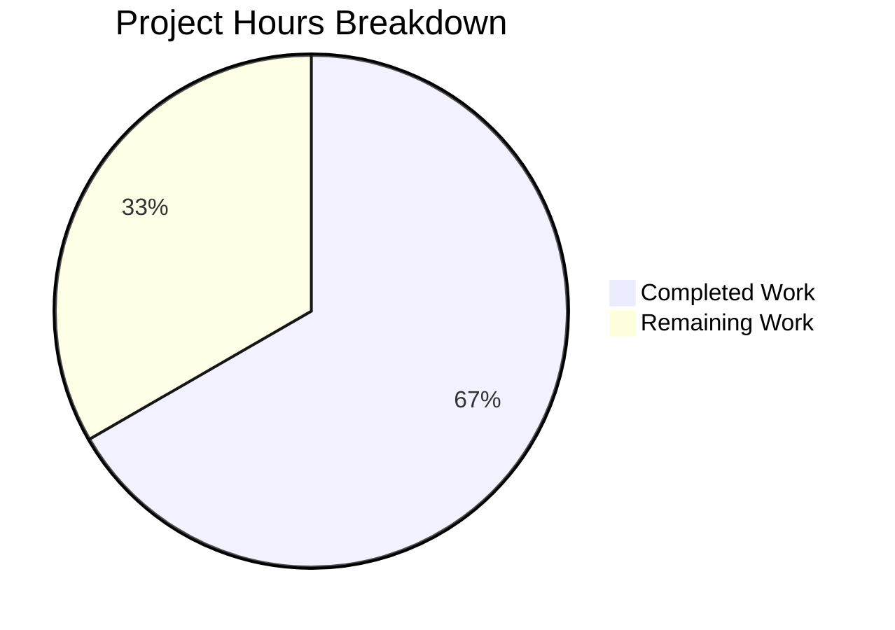

# Project Guide — Node.js/Express.js Tutorial with Jest/Supertest Test Suite

## Executive Summary

**Project completion: 67% (12 hours completed out of 18 total estimated hours)**

This greenfield Node.js tutorial project has been implemented from scratch, delivering a fully functional Express.js application with two HTTP endpoints and a comprehensive test suite. All 5 explicit requirements (R1–R5) from the Agent Action Plan are met, all 10 tests pass with 100% code coverage, and the application runs correctly in production mode. No issues were found during validation, and zero fixes were required.

### Key Achievements
- **All specified requirements delivered** — both endpoints (`GET /hello` → "Hello world", `GET /evening` → "Good evening") fully implemented and tested
- **100% test pass rate** — 10/10 tests across 2 test suites
- **100% code coverage** — statements, branches, functions, and lines all at 100%
- **Zero validation issues** — no compilation errors, no test failures, no runtime problems
- **Zero vulnerabilities** — `npm audit` reports 0 security issues

### Recommended Next Steps
1. Create a `.gitignore` file to prevent committing `node_modules/` and `coverage/`
2. Perform human code review and acceptance testing
3. Set up CI/CD pipeline for automated testing (GitHub Actions)
4. Add production hardening if deploying beyond tutorial use

---

## Hours Calculation

**Completed: 12h** (source code 2h + tests 4.5h + config 2h + docs 1h + dependency mgmt 1h + runtime validation 1.5h)
**Remaining: 6h** (base 4h × 1.15 compliance × 1.25 uncertainty ≈ 6h)
**Total: 18h**
**Completion: 12 / 18 = 66.7% ≈ 67%**

---

## Validation Results Summary

### Compilation Results (5/5 Pass)

| File | Syntax Check | Status |
|------|-------------|--------|
| `src/app.js` | `node --check` | ✅ PASS |
| `src/server.js` | `node --check` | ✅ PASS |
| `tests/app.test.js` | `node --check` | ✅ PASS |
| `tests/server.test.js` | `node --check` | ✅ PASS |
| `jest.config.js` | `node --check` | ✅ PASS |

### Test Results (10/10 Pass)

**Test Suites:** 2 passed, 2 total
**Tests:** 10 passed, 0 failed, 10 total
**Execution Time:** 0.492s

| Test Suite | Test Case | Status |
|-----------|-----------|--------|
| `tests/app.test.js` | GET /hello returns "Hello world" with status 200 | ✅ PASS |
| `tests/app.test.js` | GET /hello returns correct Content-Type header | ✅ PASS |
| `tests/app.test.js` | GET /evening returns "Good evening" with status 200 | ✅ PASS |
| `tests/app.test.js` | GET /evening returns correct Content-Type header | ✅ PASS |
| `tests/app.test.js` | 404 for undefined routes | ✅ PASS |
| `tests/app.test.js` | 404 for random paths | ✅ PASS |
| `tests/server.test.js` | Server exports Express app | ✅ PASS |
| `tests/server.test.js` | Export is a function | ✅ PASS |
| `tests/server.test.js` | Valid Express application | ✅ PASS |
| `tests/server.test.js` | Does not auto-bind to port on import | ✅ PASS |

### Code Coverage (100%)

| File | Statements | Branches | Functions | Lines |
|------|-----------|----------|-----------|-------|
| All files | 100% | 100% | 100% | 100% |
| `src/app.js` | 100% | 100% | 100% | 100% |

### Runtime Validation (3/3 Pass)

| Endpoint | Expected | Actual | HTTP Status | Status |
|----------|----------|--------|-------------|--------|
| `GET /hello` | "Hello world" | "Hello world" | 200 | ✅ PASS |
| `GET /evening` | "Good evening" | "Good evening" | 200 | ✅ PASS |
| `GET /nonexistent` | 404 | 404 | 404 | ✅ PASS |

### Dependency Audit

| Check | Result |
|-------|--------|
| `npm audit` | 0 vulnerabilities |
| `npm ls --depth=0` | All 3 packages resolved (express@5.2.1, jest@30.2.0, supertest@7.2.2) |
| Git status | Clean (only `coverage/` and `node_modules/` untracked) |

### Issues Found and Fixed
**None** — all agent-created files were correct and fully functional on first validation pass.

---

## Visual Representation



---

## Completed Work Breakdown

| Component | Files | Lines of Code | Hours | Description |
|-----------|-------|---------------|-------|-------------|
| Express Application | `src/app.js` | 70 | 1.5h | Express app with `/hello` and `/evening` route handlers |
| Server Entry Point | `src/server.js` | 35 | 0.5h | Server startup with configurable PORT |
| Endpoint Integration Tests | `tests/app.test.js` | 171 | 3h | 6 Supertest integration tests for all endpoints |
| Server Unit Tests | `tests/server.test.js` | 63 | 1.5h | 4 unit tests for module exports and app validation |
| Project Configuration | `package.json` | 19 | 1h | Dependencies, scripts, project metadata |
| Jest Configuration | `jest.config.js` | 40 | 1h | Test environment, coverage thresholds, match patterns |
| Documentation | `README.md` | 95 | 1h | Prerequisites, installation, testing, project structure |
| Dependency Management | `package-lock.json` | 5,420 | 1h | Lock file generation, installation, validation |
| Runtime Verification | — | — | 1.5h | Server startup test, endpoint curl validation |
| **Total** | **8 files** | **5,913 lines** | **12h** | |

### Git History (7 feature commits)

| Commit | Message |
|--------|---------|
| `8e1b693` | Setup: Add package.json with Express.js, Jest, Supertest dependencies |
| `ae6a135` | Add package-lock.json for reproducible dependency resolution |
| `16d3c60` | Create jest.config.js with test environment and coverage thresholds |
| `775aa93` | Update README.md with comprehensive project documentation |
| `2654012` | Create src/app.js: Express application with route handlers |
| `bf5b769` | Add server entry point, endpoint and server module tests |
| `34ee0fd` | feat(tests): create comprehensive Express endpoint integration tests |

### Requirements Traceability

| Requirement | Description | Status |
|-------------|-------------|--------|
| R1 | Hello World endpoint returns "Hello world" | ✅ Implemented and tested |
| R2 | Good Evening endpoint returns "Good evening" | ✅ Implemented and tested |
| R3 | Express.js correctly integrated as HTTP framework | ✅ Verified |
| R4 | HTTP 200 status codes and correct Content-Type | ✅ Tested |
| R5 | Express app initializes without errors | ✅ Tested |
| Edge Case | 404 for undefined routes | ✅ Tested |
| Content-Type | Responses include text/html Content-Type | ✅ Tested |
| Coverage | ≥90% statement coverage | ✅ 100% achieved |

---

## Remaining Work — Detailed Task Table

| # | Task | Description | Priority | Severity | Hours | Confidence |
|---|------|-------------|----------|----------|-------|------------|
| 1 | Create `.gitignore` file | Add `.gitignore` with entries for `node_modules/`, `coverage/`, `.env`, and OS-specific files. Prevents committing generated directories to version control. | High | Medium | 1 | High |
| 2 | Human code review and acceptance testing | Review all source and test files for correctness, coding standards, and adherence to team conventions. Run manual acceptance testing of both endpoints. | High | Medium | 1.5 | High |
| 3 | CI/CD pipeline setup | Create GitHub Actions workflow (`.github/workflows/test.yml`) to run `npm install` and `npm test` on push/PR events. Configure Node.js 22 matrix, caching, and coverage reporting. | Medium | Low | 2 | Medium |
| 4 | Production hardening | Add environment variable management (`.env` + `dotenv`), custom error-handling middleware for structured 404/500 responses, and basic request logging. | Low | Low | 1.5 | Medium |
| | **Total Remaining Hours** | | | | **6** | |

### Hour Verification
- Pie chart "Remaining Work": **6h**
- Task table sum: 1 + 1.5 + 2 + 1.5 = **6h** ✓
- Pie chart "Completed Work": **12h**
- Total project hours: 12 + 6 = **18h**
- Completion percentage: 12 / 18 = **66.7% ≈ 67%** ✓

---

## Development Guide

### 1. System Prerequisites

| Component | Required Version | Verification Command |
|-----------|-----------------|---------------------|
| Node.js | 22.x (LTS Jod) | `node --version` → `v22.x.x` |
| npm | 10.x (bundled) | `npm --version` → `10.x.x` |
| Git | 2.x+ | `git --version` |

### 2. Environment Setup

```bash
# Clone the repository
git clone <repository-url>
cd <repository-directory>

# If using nvm, activate Node.js 22
export NVM_DIR="$HOME/.nvm"
[ -s "$NVM_DIR/nvm.sh" ] && \. "$NVM_DIR/nvm.sh"
nvm use 22

# Verify Node.js version
node --version
# Expected output: v22.22.0 (or any 22.x)
```

No environment variables are required. The server defaults to port 3000. To override:
```bash
export PORT=8080
```

### 3. Dependency Installation

```bash
npm install
```

**Expected output:** Installs 3 direct dependencies:
- `express@5.2.1` (production)
- `jest@30.2.0` (dev)
- `supertest@7.2.2` (dev)

Verify installation:
```bash
npm ls --depth=0
```

**Expected output:**
```
10feb_11@1.0.0
├── express@5.2.1
├── jest@30.2.0
└── supertest@7.2.2
```

### 4. Running Tests

```bash
# Run full test suite (recommended)
CI=true npx jest --watchAll=false --ci --verbose

# Alternative: via npm script
npm test

# Run with coverage report
npm run test:coverage

# Run a single test file
npx jest tests/app.test.js
```

**Expected test output:**
```
PASS tests/app.test.js (6 tests)
PASS tests/server.test.js (4 tests)
Test Suites: 2 passed, 2 total
Tests:       10 passed, 10 total
Coverage:    100% across all metrics
```

### 5. Starting the Application

```bash
# Start the Express server
node src/server.js
```

**Expected output:**
```
Server is running on port 3000
```

### 6. Verification Steps

With the server running (from step 5), verify endpoints in a separate terminal:

```bash
# Test Hello World endpoint
curl http://localhost:3000/hello
# Expected: Hello world

# Test Good Evening endpoint
curl http://localhost:3000/evening
# Expected: Good evening

# Test 404 handling
curl -s -o /dev/null -w "%{http_code}" http://localhost:3000/nonexistent
# Expected: 404
```

### 7. Project Structure

```
├── src/
│   ├── app.js              # Express app with route handlers (exported for testing)
│   └── server.js           # Server entry point (calls app.listen)
├── tests/
│   ├── app.test.js         # 6 endpoint integration tests (Supertest)
│   └── server.test.js      # 4 server module unit tests (Jest)
├── jest.config.js           # Jest configuration with coverage thresholds
├── package.json             # Dependencies and npm scripts
├── package-lock.json        # Dependency lock file
└── README.md                # Project documentation
```

### 8. Troubleshooting

| Issue | Solution |
|-------|----------|
| `nvm: command not found` | Install nvm: `curl -o- https://raw.githubusercontent.com/nvm-sh/nvm/v0.40.0/install.sh \| bash` |
| `EADDRINUSE: port 3000` | Another process is using port 3000. Kill it (`lsof -i :3000`) or use `PORT=8080 node src/server.js` |
| Jest enters watch mode | Use `CI=true npx jest --watchAll=false` to prevent watch mode |
| `Cannot find module 'express'` | Run `npm install` to install dependencies |

---

## Risk Assessment

### Technical Risks

| Risk | Severity | Likelihood | Mitigation |
|------|----------|-----------|------------|
| No `.gitignore` file — `node_modules/` could be committed | Medium | High | Create `.gitignore` before next commit (Task #1) |
| No input validation on endpoints | Low | Low | Endpoints return static strings; no user input is processed |
| Express 5.x is relatively new | Low | Low | Well-tested with Supertest; all tests pass consistently |

### Security Risks

| Risk | Severity | Likelihood | Mitigation |
|------|----------|-----------|------------|
| No security headers (Helmet) | Low | Medium | Add `helmet` middleware if deploying to production |
| No rate limiting | Low | Low | Add `express-rate-limit` if exposed to public internet |
| No CORS configuration | Low | Low | Add `cors` middleware if accessed from browser clients |
| 0 npm audit vulnerabilities | None | N/A | Current state is clean; monitor with `npm audit` |

### Operational Risks

| Risk | Severity | Likelihood | Mitigation |
|------|----------|-----------|------------|
| No health check endpoint | Low | Medium | Add `GET /health` returning 200 for monitoring |
| No structured logging | Low | Medium | Add `morgan` or `winston` for production logging |
| No process manager | Low | Medium | Use PM2 or systemd for production process management |
| No graceful shutdown handling | Low | Low | Add `SIGTERM` handler for clean server shutdown |

### Integration Risks

| Risk | Severity | Likelihood | Mitigation |
|------|----------|-----------|------------|
| No CI/CD pipeline | Medium | High | Set up GitHub Actions for automated testing (Task #3) |
| No containerization | Low | Medium | Create Dockerfile if deploying to container platforms |
| No environment-specific config | Low | Medium | Add `.env` support with `dotenv` package (Task #4) |

---

## Technology Stack

| Component | Technology | Version |
|-----------|-----------|---------|
| Runtime | Node.js (LTS Jod) | 22.22.0 |
| Package Manager | npm | 10.9.4 |
| Web Framework | Express.js | 5.2.1 |
| Test Runner | Jest | 30.2.0 |
| HTTP Testing | Supertest | 7.2.2 |
| Coverage Engine | Istanbul/V8 (via Jest) | Built-in |
