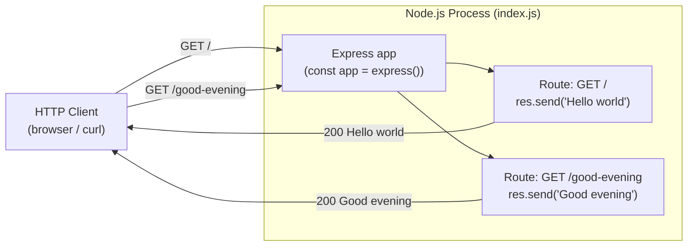
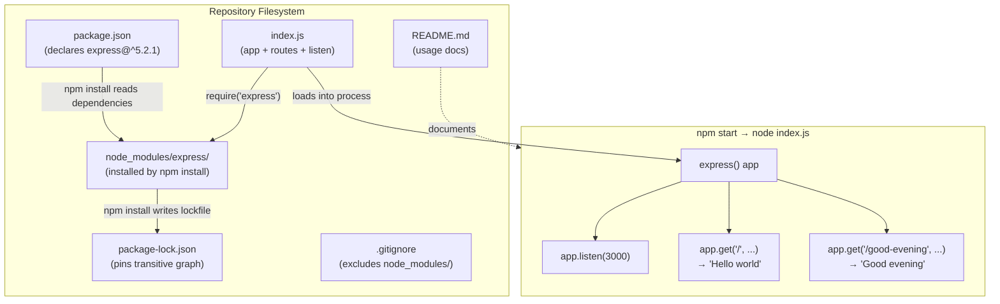

# Technical Specification

# 0. Agent Action Plan

## 0.1 Intent Clarification

### 0.1.1 Core Feature Objective

Based on the prompt, the Blitzy platform understands that the new feature requirement is to introduce the Express.js web framework into an existing Node.js HTTP server tutorial and expose a second HTTP GET endpoint that returns the text response `Good evening`, while preserving the existing `Hello world` endpoint behavior as part of a simple, educational server.

Restated with technical precision, the feature set breaks down as follows:

- **Primary Requirement — Introduce Express.js:** Add Express.js (package `express`) as a first-class runtime dependency declared in `package.json`, install it into `node_modules/` via npm, and refactor the existing Node.js HTTP server so that the HTTP listener, routing, and request/response lifecycle are mediated by the Express application object (`const app = express()`) rather than the lower-level `http.createServer(...)` primitive.
- **Primary Requirement — Add `Good evening` endpoint:** Register an additional HTTP GET route (target path `/good-evening`) on the Express `app` instance that responds with the exact string `Good evening` and an HTTP 200 status, co-existing with the pre-existing `Hello world` endpoint.
- **Preservation Requirement — Retain `Hello world` endpoint:** The original endpoint that returns `Hello world` must continue to work after the migration. It will be re-implemented as an Express route (target path `/`) returning the exact string `Hello world`, maintaining response semantics familiar to the tutorial audience.

#### Implicit Requirements Surfaced

The following implicit requirements are not stated verbatim in the prompt but are direct technical consequences of honoring it:

- **Package manifest bootstrap.** The repository currently has no `package.json` (see Section 0.2), so the Blitzy platform must initialize a Node.js package manifest in order to declare the new `express` dependency, define a `main` entry point, and expose a `start` script for running the server.
- **Lockfile generation.** Installing `express` via npm will produce (and must commit) a `package-lock.json` to pin the transitive dependency graph for reproducible builds of this tutorial.
- **Ignore rules for Node artifacts.** A `.gitignore` file must be introduced (or, if absent, created) so the generated `node_modules/` tree and common Node.js artifacts are excluded from version control, which is the universally expected convention for Node.js projects.
- **Server entry file.** A runnable server source file (chosen canonical name: `index.js`) must exist at the repository root. Since the current repository contains only a `README.md` and no JavaScript source (see Section 0.2), this file must be authored from scratch during this feature addition — it does not yet exist despite the user's framing of an "existing" tutorial.
- **Port binding.** The Express server must bind to a TCP port. A sensible default of `3000` is adopted (matching the idiomatic example in the Express README and npm documentation) and is derived from `process.env.PORT` when present to preserve platform portability.
- **Listener boot logging.** On successful `app.listen(...)` invocation the server must log a human-readable confirmation message (e.g., `Server is running on http://localhost:3000`) to aid the tutorial reader.
- **README documentation update.** The current `README.md` contains only a single top-level heading (`# 10feb_11`) with no descriptive content. It must be updated to document how to install dependencies, start the server, and invoke both endpoints.

#### Feature Dependencies and Prerequisites

- **Runtime prerequisite — Node.js ≥ 18:** Express 5.x requires Node.js 18 or higher. The execution environment used for validation reports `node --version` = `v22.22.2` and `npm --version` = `11.1.0`, which both satisfy the Express 5 minimum runtime floor.
- **Registry prerequisite — public npm registry:** Installation of `express` must resolve against `https://registry.npmjs.org/` (the default public npm registry). No private package registry or authenticated scope is required for this tutorial feature.
- **Tooling prerequisite — npm CLI:** The feature uses npm (as opposed to Yarn or pnpm) for dependency installation. This is consistent with the out-of-the-box Node.js toolchain and the absence of any Yarn/pnpm artifacts in the repository.

### 0.1.2 Special Instructions and Constraints

- **CRITICAL — Preserve the tutorial character:** The user explicitly framed the project as "a tutorial of node js server." The implementation must therefore remain minimal, single-file, and readable. No premature abstractions (no controller/service/router splitting, no TypeScript, no build step, no linter configuration, no test framework) are to be introduced because none were requested and none match the tutorial tone.
- **CRITICAL — Preserve response wording:** The strings must be returned verbatim, not paraphrased. The two responses are:
    - `Hello world` — User Example (existing endpoint response): `Hello world`
    - `Good evening` — User Example (new endpoint response): `Good evening`
- **CRITICAL — Preserve the existing endpoint:** The prompt says "add another endpoint," which unambiguously means an additional endpoint alongside the original. The original `Hello world` endpoint must remain reachable after the change.
- **Architectural constraint — Single Express application:** Both endpoints must be registered on the same Express `app` instance and served by a single HTTP listener on a single port. Splitting the two endpoints across two processes or two listeners would contradict the "add another endpoint" framing.
- **Architectural constraint — Use Express idioms:** Because the user requested Express.js specifically, the routing must be expressed through `app.get('/path', handler)` and the response must be produced via `res.send(...)` (or `res.status(200).send(...)`). Continuing to hand-write `req.url` comparisons and `res.writeHead`/`res.end` calls inside an Express handler would defeat the purpose of adopting the framework.
- **Backward-compatible behavior:** A client that previously issued `GET /` (or `GET` against the root path) and received `Hello world` must receive the same body and an HTTP 200 status after the change.
- **Research directive:** Web search was required to confirm the current stable major version of Express.js and its Node.js runtime floor before pinning the dependency version. Results captured in Section 0.8 References.

#### User Examples Preserved Verbatim

- User Example (framing of the existing project): `this is a tutorial of node js server hosting one endpoint that returns the response "Hello world"`
- User Example (requested change): `Could you add expressjs into the project and add another endpoint that return the reponse of "Good evening"?`

### 0.1.3 Technical Interpretation

These feature requirements translate to the following technical implementation strategy:

- To introduce Express.js into the project, the Blitzy platform will create a `package.json` manifest at the repository root declaring `express` as a runtime dependency pinned to the current stable version `^5.2.1` (verified via `npm view express version` on the public npm registry).
- To install the dependency, the Blitzy platform will run `npm install` which will materialize the `node_modules/` tree and generate a `package-lock.json` alongside `package.json`.
- To keep the generated `node_modules/` tree out of source control, the Blitzy platform will create a Node.js–appropriate `.gitignore` at the repository root.
- To host the two endpoints, the Blitzy platform will create `index.js` at the repository root — an Express application that imports `express`, instantiates `const app = express()`, registers `app.get('/', (req, res) => res.send('Hello world'))` for the existing endpoint, registers `app.get('/good-evening', (req, res) => res.send('Good evening'))` for the new endpoint, and calls `app.listen(port, ...)` to bind the server.
- To make the server discoverable and runnable by a reader of the tutorial, the Blitzy platform will modify `README.md` to describe the project purpose, the install step (`npm install`), the run step (`npm start` or `node index.js`), and the two endpoint URLs with their expected response bodies.

The following high-level flow diagram summarizes the runtime behavior the feature delivers:




## 0.2 Repository Scope Discovery

### 0.2.1 Current Repository State

A full filesystem sweep of the repository (excluding the `.git/` metadata directory) confirms that the repository currently contains exactly one source artifact:

| Path | Type | Size / Content | Role in Feature |
|------|------|----------------|-----------------|
| `README.md` | File (Markdown) | Single line — `# 10feb_11` | Will be modified to document the Express tutorial |

No Node.js source files, no `package.json`, no `package-lock.json`, no `node_modules/` directory, no `.gitignore`, and no tutorial server implementation currently exist in the repository. The user's prompt describes the project as a "tutorial of node js server hosting one endpoint that returns the response 'Hello world'," but that described tutorial is the intended starting premise, not a pre-existing implementation on disk. Accordingly, the `Hello world` endpoint will be materialized as part of this feature addition rather than preserved from an existing code path, with its behavior identical to what a reader of a Node.js tutorial would expect.

The following discovery evidence was recorded:

- Repository root listing via `find . -type f -not -path "./.git/*"` returned only `./README.md`.
- Root folder inspection via the code graph showed a single first-order child: `README.md`.
- Semantic searches for Node.js server files, `package.json`, and application source folders all returned zero matches.
- `git status --short` reported a clean working tree at HEAD, meaning there are no uncommitted in-flight changes to integrate.
- No `.blitzyignore` file was found anywhere on the filesystem, so no path exclusions apply beyond the standard Git metadata.

### 0.2.2 Comprehensive File Analysis

Because the repository is effectively a blank canvas with no prior source tree, there are no existing modules, tests, configurations, build artifacts, CI workflows, or documentation files to modify beyond `README.md`. The "discovery" phase therefore collapses to enumerating the files this feature must author to realize the tutorial from first principles.

#### Files that exist and will be modified

| Existing Path | Action | Reason |
|---|---|---|
| `README.md` | MODIFY | Replace placeholder heading with usage documentation for the Express tutorial: install instruction, run instruction, and both endpoint URLs with their expected response bodies |

#### Integration Point Discovery

Because no application source tree exists, there are no pre-existing integration points to thread through (no API routers, ORM models, migrations, service containers, middleware stacks, or controller layers). The Express application itself IS the only integration surface and will be created in full scope.

| Integration Category | Pre-existing Target | Outcome |
|---|---|---|
| API router registration | None | New Express `app` with two `app.get(...)` registrations inside `index.js` |
| Database models / migrations | None | N/A — feature is stateless and has no persistence |
| Service classes | None | N/A — feature is single-file with inline handlers |
| Controllers / handlers | None | Two inline arrow-function handlers on the `app` instance |
| Middleware / interceptors | None | No middleware added (not requested) |

### 0.2.3 Web Search Research Conducted

The following external research was performed to ensure the dependency pin and runtime assumptions are current and correct:

- **Best practice — Express 5 basic server recipe:** Confirmed the official npm documentation demonstrates the canonical Express 5 "hello world" recipe using `import express from 'express'`, `const app = express()`, `app.get('/', (req, res) => res.send('Hello World'))`, and `app.listen(3000, ...)`. This pattern informs the shape of the new `index.js`.
- **Library recommendation — Express 5.2.1 is the current stable release:** Verified on the public npm registry via `npm view express version` (returned `5.2.1`) and `npm view express dist-tags` (returned `{ latest: '5.2.1', 'latest-4': '4.22.1' }`). Cross-referenced with npmjs.com and endoflife.date entries for Express.
- **Runtime floor — Express 5 requires Node.js ≥ 18:** Confirmed from the Express 5.0 release notes and the npmjs package page. The execution environment's Node.js v22.22.2 satisfies this comfortably.
- **Integration pattern — Multi-route Express app:** Common idiomatic pattern confirmed as `app.get('/path', handler)` per route, all registered against the same `app` instance before `app.listen(...)`.
- **Security consideration — body parser default changes in Express 5:** Noted for completeness, but irrelevant to this feature because the two endpoints use only `res.send(...)` with static string payloads and do not read request bodies.

### 0.2.4 New File Requirements

The following files will be created to realize the feature. Relative paths are anchored at the repository root.

#### New configuration / manifest files

| New Path | Purpose |
|---|---|
| `package.json` | Node.js package manifest declaring metadata, `"main": "index.js"`, `"scripts": { "start": "node index.js" }`, and `"dependencies": { "express": "^5.2.1" }` |
| `package-lock.json` | Auto-generated lockfile produced by `npm install express` that pins the full transitive dependency graph for reproducible installs |
| `.gitignore` | Standard Node.js ignore rules — at minimum `node_modules/`, `npm-debug.log*`, and `.env` — to keep generated artifacts out of source control |

#### New source files

| New Path | Purpose |
|---|---|
| `index.js` | Single-file Express application; imports `express`, instantiates `app`, registers `GET /` returning `Hello world`, registers `GET /good-evening` returning `Good evening`, and calls `app.listen(process.env.PORT \|\| 3000, ...)` to start the HTTP listener |

#### New test files

None. The user did not request tests, and adding a test framework would violate the "keep it a tutorial" constraint surfaced in Section 0.1.2. Manual verification via `curl http://localhost:3000/` and `curl http://localhost:3000/good-evening` is the expected validation path.

#### New documentation files

No net-new documentation files beyond the modification of the existing `README.md`. A dedicated `docs/` folder would be out of proportion for a tutorial this small.


## 0.3 Dependency Inventory

### 0.3.1 Runtime and Toolchain

The following runtimes and tools are assumed to be present in the execution environment. They are not installed via `package.json`; they belong to the host system.

| Runtime / Tool | Version | Scope | Notes |
|---|---|---|---|
| Node.js | `v22.22.2` (verified via `node --version`) | System runtime | Any Node.js ≥ 18 is acceptable per Express 5's minimum; this version is well above the floor |
| npm | `11.1.0` (verified via `npm --version`) | Package manager | Ships with Node.js 22 and is used to install `express` and to run the `start` script |

### 0.3.2 Public Packages

Only a single direct public dependency is required to deliver this feature. All other packages that appear in `node_modules/` after installation are transitive dependencies of Express and will be resolved automatically by npm; they do not need to be declared in `package.json`.

| Registry | Package Name | Version | Type | Purpose |
|---|---|---|---|---|
| npm (`registry.npmjs.org`) | `express` | `^5.2.1` | `dependencies` | Provides the `express()` application factory, the `app.get(...)` routing API, `res.send(...)` response helpers, and the `app.listen(...)` HTTP binding used by `index.js` for both the `/` and `/good-evening` routes |

The exact version `5.2.1` was confirmed by querying the public npm registry with `npm view express version`, which returned `5.2.1`, and by `npm view express dist-tags`, which returned `{ latest: '5.2.1', 'latest-4': '4.22.1' }`. The `^5.2.1` caret range is used in `package.json` so that SemVer-compatible patch and minor updates within the 5.x line are accepted during future `npm install` runs, while the lockfile pins the exact graph for reproducibility.

### 0.3.3 Private Packages

None. This tutorial feature does not consume any packages from a private registry, nor any scoped private packages. No authentication to a private registry is required.

### 0.3.4 Dependency Updates (Import and Reference Changes)

Because there is no pre-existing JavaScript source tree in the repository, there are no legacy imports to rewrite, no relative import paths to refactor, and no existing configuration files or CI workflows that reference the codebase and would need to be updated.

#### Import patterns that WILL be introduced

The new `index.js` will introduce the following import:

```javascript
const express = require('express');
```

Alternatively, the equivalent ES module form `import express from 'express'` could be used, but this would require adding `"type": "module"` to `package.json` and using `.mjs`/ESM-specific semantics. For a tutorial the CommonJS `require('express')` form is preferred because it is the Node.js default when `"type"` is not set and it matches the vast majority of introductory Express examples.

#### Import patterns that WILL NOT be needed

- No existing files use an import pattern that needs to be transformed (there are no `.js` files in the repository yet).
- No wildcard sweep over `src/**/*.js`, `tests/**/*.js`, or `scripts/**/*.js` is required because none of those directories exist.

#### External Reference Updates

| Reference Category | File(s) | Change |
|---|---|---|
| Package manifest | `package.json` | Created with `"dependencies": { "express": "^5.2.1" }` |
| Lockfile | `package-lock.json` | Auto-generated by `npm install` to pin the resolved graph |
| Source control ignore rules | `.gitignore` | Created to exclude `node_modules/` and other Node.js artifacts |
| Documentation | `README.md` | Updated to reference `npm install`, `npm start`, and the two endpoint URLs |
| Build files | None beyond `package.json` | No TypeScript, webpack, Babel, or bundler configuration is needed |
| CI / CD | None | No CI workflows exist in the repository and none are to be added |


## 0.4 Integration Analysis

### 0.4.1 Existing Code Touchpoints

Because the repository presently contains only `README.md`, there are no existing source-level touchpoints to modify. The "integration" surface for this feature is therefore the set of files authored in Section 0.2.4, collectively stitched together through Node.js's native module resolution and the Express routing API.

The integration map is as follows:

| Integration Point | File | Responsibility |
|---|---|---|
| Dependency declaration | `package.json` (CREATE) | Declares `express@^5.2.1` under `dependencies`, sets `"main": "index.js"`, and exposes `"scripts": { "start": "node index.js" }` so `npm start` launches the server |
| Dependency resolution | `package-lock.json` (CREATE) | Pins the exact Express transitive graph to guarantee reproducible installs for the tutorial reader |
| Source-control hygiene | `.gitignore` (CREATE) | Excludes `node_modules/` from version control so the installed tree is not committed |
| Application entry | `index.js` (CREATE) | `require('express')` → `const app = express()` → register routes → `app.listen(port, ...)`; this single file is the composition root |
| Route — existing endpoint | `index.js` — `app.get('/', ...)` | Responds with `Hello world` and HTTP 200 to fulfill the preservation requirement |
| Route — new endpoint | `index.js` — `app.get('/good-evening', ...)` | Responds with `Good evening` and HTTP 200 to fulfill the net-new requirement |
| Runnable documentation | `README.md` (MODIFY) | Documents how to install (`npm install`), how to run (`npm start`), and how to hit both endpoints |

### 0.4.2 Dependency Injection

Not applicable. The Express tutorial pattern registers route handlers directly on the `app` instance inside `index.js` with no container, factory, or DI framework. There is no `services/container.py`-style wiring to update.

### 0.4.3 Database and Schema Updates

Not applicable. Both endpoints return static string payloads. There is no database, no ORM, no migrations directory, no schema files, no seed scripts, and no query layer. Adding any of those would exceed the user's request.

### 0.4.4 Runtime Integration Flow

The integration between the new files at runtime proceeds as follows, illustrated as a composition diagram:



### 0.4.5 Behavioral Integration Matrix

| HTTP Method | Path | Before This Feature | After This Feature |
|---|---|---|---|
| `GET` | `/` | No server exists; connection refused | `200 OK` body `Hello world` |
| `GET` | `/good-evening` | No server exists; connection refused | `200 OK` body `Good evening` |
| `GET` | Any other path (e.g. `/foo`) | No server exists; connection refused | `404 Not Found` — Express default when no route matches |

The 404 behavior for unregistered routes is the standard Express fallback and is accepted as-is; no custom 404 handler is required for this tutorial.


## 0.5 Technical Implementation

### 0.5.1 File-by-File Execution Plan

Every file listed in this section MUST be created or modified. File paths are relative to the repository root.

#### Group 1 — Package Manifest and Dependency Resolution

- **CREATE: `package.json`** — Root-level Node.js package manifest. Must declare `"name"` (suggested: `10feb_11` to match the repository identifier), `"version": "1.0.0"`, `"description"` describing the Express tutorial, `"main": "index.js"`, `"scripts": { "start": "node index.js" }`, and `"dependencies": { "express": "^5.2.1" }`. No `devDependencies` are required.
- **CREATE: `package-lock.json`** — Must be generated by running `npm install` in the repository root after `package.json` is written. It will pin `express@5.2.1` plus the full transitive graph (including `accepts`, `body-parser`, `content-type`, `cookie`, `debug`, `depd`, `encodeurl`, `etag`, `finalhandler`, `fresh`, `merge-descriptors`, `methods`, `mime-types`, `parseurl`, `proxy-addr`, `qs`, `router`, `send`, `serve-static`, `statuses`, `type-is`, `utils-merge`, `vary`, and their transitive children). Do not hand-edit this file.

#### Group 2 — Core Feature File

- **CREATE: `index.js`** — Single-file Express application that is the composition root for the tutorial. It MUST:
    - `require('express')` as the first statement.
    - Instantiate the application: `const app = express()`.
    - Register the existing endpoint: `app.get('/', (req, res) => { res.send('Hello world'); });`.
    - Register the new endpoint: `app.get('/good-evening', (req, res) => { res.send('Good evening'); });`.
    - Select a port: `const port = process.env.PORT || 3000;`.
    - Start the HTTP listener: `app.listen(port, () => { console.log(`Server is running on http://localhost:${port}`); });`.
    - Keep ordering such that the two `app.get(...)` registrations occur before `app.listen(...)`.

A minimal, faithful implementation skeleton (not intended to be expanded with extra middleware or plugins) looks like:

```javascript
const express = require('express');
const app = express();
app.get('/', (req, res) => res.send('Hello world'));
app.get('/good-evening', (req, res) => res.send('Good evening'));
app.listen(process.env.PORT || 3000);
```

#### Group 3 — Supporting Infrastructure

- **CREATE: `.gitignore`** — Standard Node.js ignore list. At minimum must include `node_modules/`, `npm-debug.log*`, `yarn-debug.log*`, `yarn-error.log*`, and `.env`. This prevents the generated dependency tree and local environment files from being committed.

#### Group 4 — Documentation

- **MODIFY: `README.md`** — Replace the single-line placeholder `# 10feb_11` with a tutorial-appropriate document. The updated README MUST describe:
    - What the project is — "A minimal Node.js tutorial server built with Express.js that exposes two GET endpoints."
    - Prerequisites — Node.js ≥ 18 and npm.
    - Installation — `npm install`.
    - Running the server — `npm start` (or `node index.js`).
    - Endpoints table or equivalent, listing:
        - `GET /` → responds with `Hello world`
        - `GET /good-evening` → responds with `Good evening`
    - Sample `curl` invocations that a tutorial reader can copy, e.g. `curl http://localhost:3000/` and `curl http://localhost:3000/good-evening`.

### 0.5.2 Implementation Approach per File

- **`package.json`** — Establishes the feature foundation by declaring the Express dependency and the `start` script. Without this file, `npm install` cannot resolve `express` and `npm start` cannot run the server. Authored first.
- **`package-lock.json`** — Produced automatically by `npm install` after `package.json` is authored. Provides reproducibility guarantees across machines reading the tutorial. Must be committed, not edited.
- **`.gitignore`** — Ensures source-control hygiene by keeping `node_modules/` out of commits. Authored before `npm install` runs so that the first commit after installation cleanly excludes the generated tree.
- **`index.js`** — Implements the two endpoints on a single Express `app` and starts the listener. This file is the only place where application logic lives and is therefore the clearest signal of the tutorial's intent.
- **`README.md`** — Documents usage and configuration. The updated README turns the repository from an unexplained identifier into a runnable, self-describing tutorial that a reader can clone, install, and exercise in under a minute.

#### Figma References

Not applicable. No Figma URLs, frames, or design attachments were provided in the user's prompt. The feature has no visual/UI surface; it is purely an HTTP API tutorial.

### 0.5.3 User Interface Design

Not applicable. The feature delivers plain-text HTTP responses (`Hello world`, `Good evening`) and has no HTML, no CSS, no client-side JavaScript, and no UI framework. There is no UI design to summarize, and no design-system alignment is required. The "interface" for this tutorial is the command line (via `curl`) or a browser navigating to the endpoint URLs, both of which render the raw text the server emits.


## 0.6 Scope Boundaries

### 0.6.1 Exhaustively In Scope

The following files and behaviors are in scope for this feature addition. The list is exhaustive — there are no additional files or behaviors beyond those listed here.

#### Feature source files

| Path | Action | Purpose |
|---|---|---|
| `index.js` | CREATE | Single-file Express application composition root registering `GET /` → `Hello world` and `GET /good-evening` → `Good evening`, then calling `app.listen(...)` |

#### Package manifest and lockfile

| Path | Action | Purpose |
|---|---|---|
| `package.json` | CREATE | Declare `express@^5.2.1` dependency, `"main": "index.js"`, and `"scripts": { "start": "node index.js" }` |
| `package-lock.json` | CREATE | Auto-generated by `npm install`; pins the full transitive dependency graph |

#### Source-control hygiene

| Path | Action | Purpose |
|---|---|---|
| `.gitignore` | CREATE | Exclude `node_modules/`, `npm-debug.log*`, and `.env` (and analogous Node artifacts) from version control |

#### Route registration points

- `index.js` — one `app.get('/', ...)` invocation for the existing `Hello world` endpoint
- `index.js` — one `app.get('/good-evening', ...)` invocation for the new `Good evening` endpoint

#### Server boot points

- `index.js` — exactly one `app.listen(...)` invocation that binds to `process.env.PORT || 3000`

#### Documentation

| Path | Action | Purpose |
|---|---|---|
| `README.md` | MODIFY | Replace the single placeholder heading with tutorial-appropriate content: project description, prerequisites, install step (`npm install`), run step (`npm start`), endpoints table, and `curl` examples |

#### Configuration

- No additional configuration files beyond `package.json`, `package-lock.json`, and `.gitignore`. No `.env`, no `.env.example`, no YAML/TOML config, no ESLint/Prettier/TypeScript configuration.

#### Tests

- No test files. Manual verification via `curl http://localhost:3000/` (expect body `Hello world`) and `curl http://localhost:3000/good-evening` (expect body `Good evening`) is the agreed validation approach.

#### Database changes

- None. The feature is stateless; no migrations, schemas, or model files.

### 0.6.2 Explicitly Out of Scope

The following are explicitly NOT part of this feature addition. Any of them would exceed the user's request and introduce complexity inappropriate for the tutorial tone.

- **Authentication and authorization.** No login, JWT, OAuth, API key, session middleware, or user model.
- **Additional endpoints beyond the two requested.** No health-check endpoint, no `/api/*` prefix, no catch-all 404 handler, no metrics endpoint.
- **Non-GET HTTP methods.** No `POST`, `PUT`, `PATCH`, or `DELETE` route registrations.
- **Request/response middleware.** No `body-parser`/`express.json()`/`express.urlencoded()` wiring, no CORS middleware, no `helmet`, no `morgan`, no compression, no rate limiting, no request logging beyond the boot message.
- **Environment variable schema beyond `PORT`.** No `dotenv`, no environment validation, no configuration layer.
- **Testing framework.** No Jest, Mocha, Vitest, Supertest, or any other test harness. No test runner scripts. No coverage tooling.
- **Linting and formatting.** No ESLint, Prettier, Standard, or EditorConfig configuration.
- **TypeScript.** No `tsconfig.json`, no `.ts` source files, no type definition packages such as `@types/express`.
- **Build step.** No Babel, esbuild, webpack, Rollup, or Vite configuration. The file runs directly under Node.js.
- **Process management.** No `nodemon`, `pm2`, or `forever`. Running the server is a direct `node index.js` invocation.
- **Container or orchestration artifacts.** No `Dockerfile`, no `docker-compose.yml`, no Kubernetes manifests, no CI/CD workflow files.
- **Database or persistence layer.** No SQL, no MongoDB, no Redis, no ORMs (Sequelize, Prisma, TypeORM, Mongoose), no migrations folder, no seed scripts.
- **Templating / view engines.** No Pug, EJS, Handlebars, or other server-side rendering setup; the responses are plain text, not HTML.
- **Static asset serving.** No `public/` folder and no `express.static(...)` mounting.
- **Multi-file architectural refactors.** No splitting of routes into `routes/` modules, no controllers folder, no services folder, no dependency-injection container. The tutorial intentionally lives in a single file.
- **Unrelated modifications to the repository.** The single existing file outside of new artifacts — `README.md` — is modified only to document this feature; no other edits to it are in scope.
- **Performance tuning.** No clustering, no worker threads, no keep-alive tuning, no cache headers. Default Express behavior is accepted as-is.


## 0.7 Rules for Feature Addition

### 0.7.1 User-Provided Rules

The user's prompt did not include an explicit rules block, and the "User specified implementation rules for this project" array supplied to this planning pass is empty (`[]`). There are therefore no verbatim user-provided rules to enforce beyond what is stated in the prompt itself. The rules below are the technical-integrity rules derived directly from the prompt wording and from the preservation constraints surfaced in Section 0.1.

### 0.7.2 Feature-Specific Rules Derived From Prompt

The following rules are non-negotiable for this feature and MUST be honored by downstream code-generation steps:

- **R1 — Verbatim response strings.** The two response bodies MUST be exactly `Hello world` and `Good evening`. Do not change capitalization, pluralization, or punctuation, and do not append trailing exclamation marks or periods. This follows from the user's explicit wording in the prompt.
- **R2 — Preserve the existing endpoint.** The `Hello world` endpoint MUST remain reachable after the change, on HTTP `GET` against the root path `/`. The prompt says "add another endpoint," which means additive, not replacement.
- **R3 — Single Express application.** Both endpoints MUST be registered on the same `const app = express()` instance inside `index.js` and served by a single `app.listen(...)` call on a single port. Do not spawn two listeners or two processes.
- **R4 — Use Express idioms.** Route registration MUST use `app.get('/path', handler)` and responses MUST be produced via `res.send(...)` (or `res.status(200).send(...)`). Do not fall back to raw `http` module semantics such as `res.writeHead(...)` / `res.end(...)` inside the Express handlers.
- **R5 — Pin Express at `^5.2.1`.** The `express` entry in `package.json`'s `dependencies` MUST be `^5.2.1`. This is the version verified against the public npm registry at planning time and the stable `latest` tag of the `express` package.
- **R6 — Commit the lockfile.** `package-lock.json` MUST be committed to source control alongside `package.json`. Do not gitignore it.
- **R7 — Do NOT commit `node_modules/`.** The `.gitignore` MUST exclude the `node_modules/` directory. The installed dependency tree is reproduced by `npm install` and is never versioned.
- **R8 — Keep the tutorial flat.** Do not introduce additional folders (`src/`, `routes/`, `controllers/`, `tests/`, `config/`, `docs/`). All application code lives in the root-level `index.js`. This preserves the tutorial's readability.
- **R9 — No hidden behavior in responses.** The two handlers MUST NOT set custom content-type, cache-control, or CORS headers. They MUST NOT read from `req.query`, `req.body`, `req.params`, or `req.headers`. They are pure constant responders.
- **R10 — Default port is 3000 with `PORT` override.** The server MUST listen on `process.env.PORT || 3000`. The default aligns with Express's canonical examples; the override enables trivial deployment to platforms that inject a port.
- **R11 — Boot message on successful listen.** The `app.listen(...)` callback MUST log a human-readable message including the bound port so the tutorial reader can confirm the server is up.
- **R12 — CommonJS require.** The initial import MUST be `const express = require('express');` unless `"type": "module"` is intentionally added to `package.json` (which is not planned here). This avoids ESM pitfalls that would confuse a reader of an introductory tutorial.
- **R13 — No new system-level installs.** The feature MUST NOT rely on globally installed CLIs (`express-generator`, `nodemon`, etc.). Everything needed is local in `node_modules/` after `npm install`.
- **R14 — Leave unrelated state untouched.** The `.git/` directory, its history, and any branches must not be modified beyond the normal commits that accompany the new files. The repository identifier surfaced by `README.md` — `10feb_11` — may be reused as the `"name"` field in `package.json` but must not be renamed or removed from `README.md` unless replaced with equivalent descriptive content.

### 0.7.3 Integration and Quality Rules

- **R15 — Registration order.** Route registrations (`app.get(...)`) MUST appear before `app.listen(...)` in `index.js` so they are mounted before the HTTP listener starts accepting connections.
- **R16 — Pure-function handlers.** Each handler MUST be a synchronous arrow function that invokes `res.send(...)` exactly once. Do not introduce `async`/`await` or promise chains where none are needed.
- **R17 — No shared mutable state.** The two endpoint handlers MUST NOT share or mutate any module-level variables. This is trivial here because both are stateless constant responders, but the rule forbids any "request counter" or similar additions.
- **R18 — Documentation parity.** Every endpoint registered in `index.js` MUST also appear in the `README.md` endpoints table with its path and expected response body. If in the future a third endpoint is added, the README must be updated in the same change.


## 0.8 References

### 0.8.1 Repository Files and Folders Searched

The following paths and queries were examined during the context-gathering phase. All paths are absolute to the repository root unless noted otherwise.

#### Folders inspected

| Path | Tool | Outcome |
|---|---|---|
| `` (repository root) | `get_source_folder_contents` | Returned exactly one first-order child — `README.md`. No application source tree exists. |

#### Files inspected

| Path | Tool | Outcome |
|---|---|---|
| `README.md` | `read_file` (lines 1 → end) | Confirmed content is a single line: `# 10feb_11`. No project metadata, no setup instructions, no references to Node.js or Express. |

#### Filesystem sweeps (via shell)

| Command | Purpose | Outcome |
|---|---|---|
| `find / -name ".blitzyignore" -type f` | Locate any `.blitzyignore` files across the container | None found; no path-exclusion directives apply |
| `find . -maxdepth 3 -type f` | Enumerate non-`.git` working-tree files | Only `./README.md` (plus `.git/` internal files which are tool metadata, not project source) |
| `ls -la .` | Confirm root directory hidden and visible entries | `.git/` and `README.md` only |
| `git status --short` | Verify clean working tree at HEAD | Clean; no uncommitted changes to integrate |
| `ls /tmp/environments_files/` | Check for user-supplied attachments directory | Directory does not exist — no attachments were provided |
| `node --version` | Determine installed Node.js runtime | `v22.22.2` — satisfies Express 5 minimum (≥18) |
| `npm --version` | Determine installed npm CLI version | `11.1.0` |
| `npm view express version` | Query public npm registry for latest Express release | `5.2.1` |
| `npm view express dist-tags` | Confirm the `latest` and `latest-4` dist-tags | `{ latest: '5.2.1', 'latest-4': '4.22.1' }` |
| `npm view express@5.2.1 dependencies` | Enumerate Express 5.2.1 transitive dependencies | Returned set including `qs`, `send`, `body-parser`, `router`, `accepts`, `type-is`, `parseurl`, `statuses`, `encodeurl`, `mime-types`, `proxy-addr`, `escape-html`, `fresh`, `cookie`, `etag`, `once`, `vary`, `depd`, `debug` |
| `npm install express` (dry-run and real, in an isolated scratch directory `/tmp/nodejs_express_validation/`) | Validate that Express 5.2.1 installs cleanly under Node.js v22.22.2 | 65 packages added successfully; `node_modules/express/package.json` reports `version: 5.2.1` |

#### Semantic searches executed

| Query | Tool | Result |
|---|---|---|
| "node.js server files with endpoints returning responses" | `search_files` | 0 matches — confirms no Node.js server source exists |
| "package.json javascript node modules" | `search_files` | 0 matches — confirms no npm manifest exists |
| "source code directory with application files" | `search_folders` | 0 matches — confirms no application source folder exists |

#### Technical specification sections consulted (background context)

The repository-level Technical Specification describes a different, unrelated parent project (the Reverse Document Generator — a Python/LangGraph job). It was reviewed to ensure no conflict with this feature addition:

| Section Heading | Purpose of Consultation |
|---|---|
| 1.1 Executive Summary | Confirmed the parent spec describes an unrelated Python system, not the Node.js tutorial repository being modified |
| 1.2 System Overview | Confirmed no Express or Node.js application surfaces are referenced in the parent system |
| 1.3 Scope | Confirmed the parent system is explicitly a headless batch job with no HTTP endpoints |
| 2.1 Feature Catalog | Confirmed none of the catalogued features (F-001 … F-014) overlap with an HTTP tutorial server |
| 3.1 Programming Languages | Confirmed Python 3.12 is the parent system's primary language; Node.js 20 LTS is listed only as a supporting runtime for MCP tool servers, not for application logic |
| 3.2 Frameworks & Libraries | Confirmed no web framework (such as Express) is declared in the parent system's dependency inventory |

### 0.8.2 User-Provided Attachments

No attachments were provided by the user for this feature addition. Verified via:

- The "User attached 0 environments to this project" declaration in the input.
- The empty "Setup Instructions provided by the user" block.
- The empty environment-variable and secret name lists.
- The `/tmp/environments_files/` directory not existing on the filesystem.
- The empty "User specified implementation rules for this project" array (`[]`).

### 0.8.3 Figma References

No Figma URLs, frame names, or design attachments were supplied in the user's prompt. The feature has no UI surface. Therefore no Figma screens are documented, and no Figma MCP interaction was required.

### 0.8.4 External Web References Cited

The following public web sources were consulted via web search to verify dependency version and runtime floor. Citations are intended to let downstream agents re-verify the facts before authoring code.

| Source | Purpose | Fact Extracted |
|---|---|---|
| `https://www.npmjs.com/package/express` | Official npm package page for Express | Latest version is `5.2.1`; Node.js 18 or higher is required; canonical `app.get('/', (req, res) => { res.send('Hello World') })` recipe |
| `https://github.com/expressjs/express/releases` | Official Express release notes on GitHub | Express v5 was officially released and dropped support for Node.js versions before v18 |
| `https://endoflife.date/express` | End-of-life tracker for Express | Supports the position that Express 5 is the current supported major line |
| `https://www.trevorlasn.com/blog/whats-new-in-express-5` | Secondary confirmation of Express 5 release and runtime requirements | Confirms Express 5 requires Node.js 18+ and was released on October 15, 2024 |
| Public npm registry (`registry.npmjs.org`) via `npm view express` | Authoritative version source | `latest = 5.2.1`; `latest-4 = 4.22.1` |


